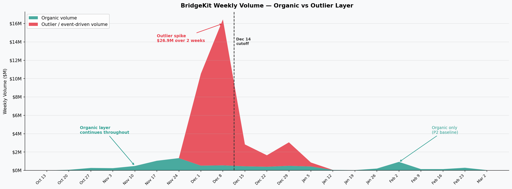
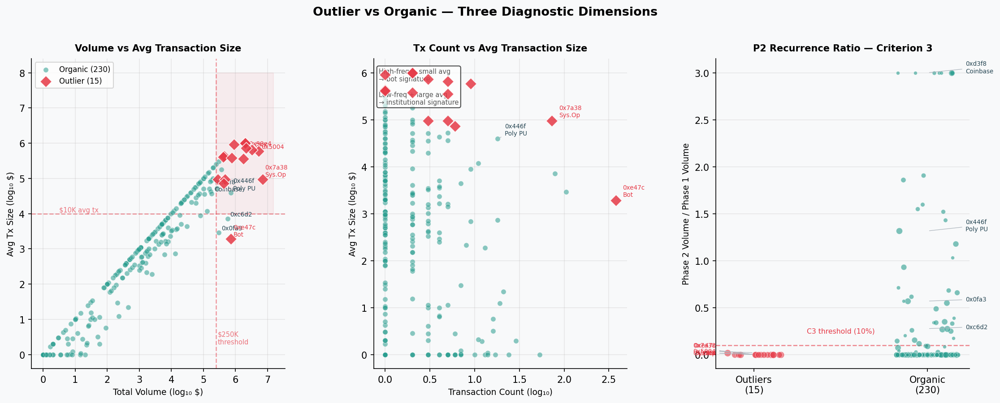
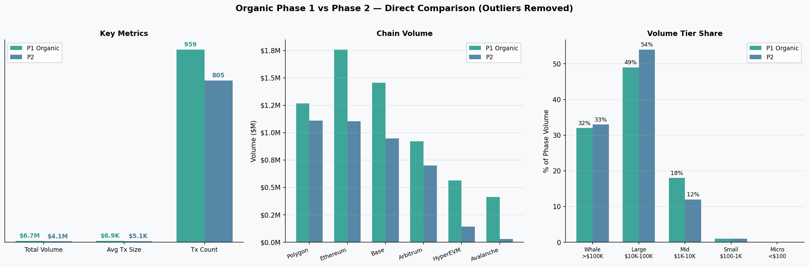
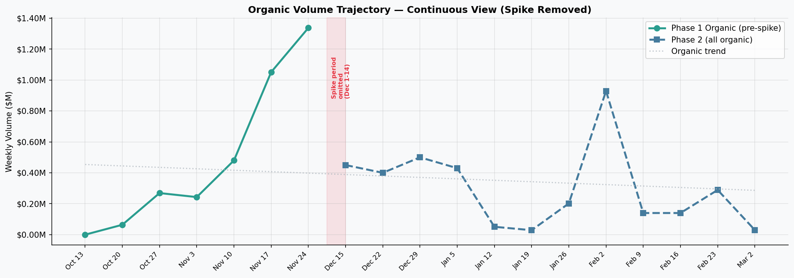
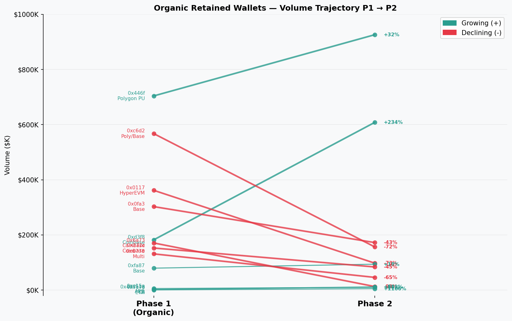
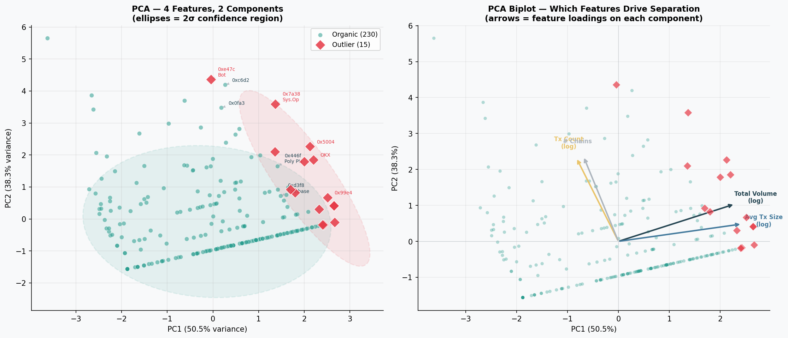
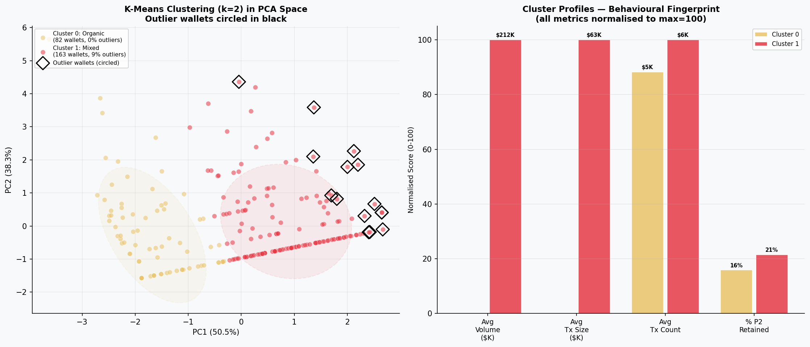
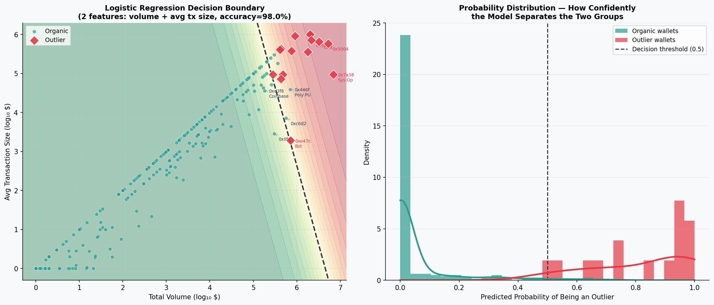

# BridgeKit Usage Analysis
# — From Headline Numbers to Organic Reality

**Analysis Date:** March 16, 2026
**Data Source:** BridgeKit Full Data (Oct 14, 2025 – Mar 3, 2026)
**Total dataset:** 550 wallet-chain records, 245 unique wallets, ~$34.5M volume

---

## Executive Summary

- The apparent 74% volume collapse between phases was a **whale exit, not user churn** — 15 event-driven wallets accounted for 82% of Phase 1 volume and vanished after December 14
- The organic platform declined a real but manageable **38%**, with consistent chain preferences and user tier structure across both phases
- The December spike was triggered by a cluster of external events (chain launches, CEX settlements, institutional rebalancing) — not platform growth
- **The right recovery target is $107K/day organic run rate** — doubling current levels, not chasing the outlier-inflated $490K/day headline
- The highest-value next step is converting the Systematic Operator type into a recurring enterprise relationship; all other growth comes from deepening the organic cohort

---

## How to Read This Report

This report works through the data the same way the analysis did: starting from the raw picture, noticing what looks unusual, investigating it, and progressively stripping away noise until the real platform story emerges. Each section builds on the previous one.

---

## Section 1: The Overall Picture — A Platform With a Spike

The first thing to do with any usage dataset is look at it end to end. Here is BridgeKit's weekly volume from launch to the present:

The platform launched in October and grew steadily through November. Then, in the first two weeks of December, volume exploded — a roughly 4x weekly spike that lasted exactly 14 days and vanished. After December 14, volume dropped sharply and has been running at a much lower level since.

**The raw aggregate numbers:**

| Period | Dates | Days | Total Volume | Daily Average |
|--------|-------|------|-------------|---------------|
| Phase 1 | Oct 14 – Dec 14 | 62 | $30,428,476 | $490K |
| Phase 2 | Dec 15 – Mar 3 | 79 | $4,113,967 | $52K |
| **Change** | | | **-73.7%** | |

A 74% volume drop after 62 days is an alarming headline — but before drawing any conclusions, the right question is: *what was inside that December spike?*

### Choosing the Phase Cutoff

The Dec 14 cutoff is not an arbitrary calendar split. It is the last day of the spike. Weekly volume went from $7.8M (Dec 8-14) to $890K (Dec 15-21) — a 89% single-week drop. This kind of abrupt, cliff-edge decline does not happen to organic user bases; they taper. Something structural changed on December 14.

---

## Section 2: Zooming Into Phase 1 — The Spike Needs Explaining

Phase 1 contains $30.4M of volume across 245 unique wallets. But the top 15 wallets alone account for 82% of it. In a genuine organic user base of this size, that level of concentration is unusual — and it raises an immediate question: are these 15 wallets the same kind of users as the other 230?

The chart above tests three independent dimensions. **Left**: the 15 large wallets sit in a distinct upper-right zone on a log-scale volume vs avg transaction size plot — separated from the organic population by an order of magnitude. **Centre**: one wallet ran 377 transactions at $1,913 average (a bot signature); others moved $600K+ per transaction in 1–9 operations (an institutional signature). **Right**: in Phase 2, the large wallets cluster at or near zero activity, while the organic population spreads above the 10% recurrence line.

Three different dimensions. Same 15 wallets isolated every time.

### The Classification

A wallet is classified as an outlier only if it passes all three criteria simultaneously:

- **C1 — Materiality**: Volume ≥ $250K, or tx count ≥ 200 with programmatic signature
- **C2 — Behavioral Signature**: At least one directly observable signal of event-driven or automated activity (exact round-number amounts, CEX on-chain label, systematic directional execution, launch-day single transaction, abrupt programmatic stop)
- **C3 — Non-Recurrence**: Phase 2 volume < 10% of Phase 1 volume

The result: **15 wallets, $27.9M, 13 of 15 with exactly $0 Phase 2 activity.** No borderline cases — every one of the 15 passes all three criteria clearly, and every high-volume wallet that continued using the platform in Phase 2 was kept in the organic pool.

The full evidence table, threshold sensitivity analysis, and machine learning validation (PCA, K-means, logistic regression — all independently recovering the same 15-wallet partition) are in [Appendix A](#appendix-a-outlier-classification-evidence) and [Appendix B](#appendix-b-machine-learning-validation) for readers who want to examine the methodology in detail.

---

## Section 3: Organic Phase 1 vs Phase 2 — What the Real Platform Looks Like

With the 15 outlier wallets removed, the phase comparison changes completely.

### Organic Metrics

| Metric | Phase 1 Organic | Phase 2 | Change |
|--------|----------------|---------|--------|
| **Total Volume** | $6,663,383 | $4,113,967 | -38% |
| **Transaction Count** | 959 | 805 | -16% |
| **Avg Transaction Size** | $6,948 | $5,111 | -26% |
| **Unique Wallets** | 230 | 151 | -34% |
| **Organic Daily Run Rate** | $107K/day | $52K/day | -51% |
| **Organic Retention Rate** | — | 20.4% (47/230) | — |

The -38% volume decline is real and should not be minimized — the platform did contract. But this is a normal DeFi seasonal trough (Nov peak → Jan low), not a structural collapse. The transaction count fell only 16%, meaning users transacted at slightly smaller sizes, not that they abandoned the product.

**The right benchmark now:** Phase 2 is at $52K/day organic run rate. Phase 1 organic was $107K/day. The platform needs to double its organic daily run rate — that is the specific goal. Not recover $490K/day (which was the outlier-inflated Phase 1 headline) — $107K/day.

### Chain Preferences Are Consistent

| Chain | P1 Organic Volume | P1 Share | P2 Volume | P2 Share | Signal |
|-------|-------------------|----------|-----------|----------|--------|
| **Ethereum** | $1,759K | 26% | $1,104K | 27% | Stable |
| **Polygon** | $1,267K | 19% | $1,111K | 27% | Growing share |
| **Base** | $1,455K | 22% | $949K | 23% | Stable |
| **Arbitrum** | $920K | 14% | $700K | 17% | Stable |
| **HyperEVM** | $565K | 8% | $143K | 3% | Launch novelty fading |
| **Avalanche** | $413K | 6% | $29K | 1% | Near-exit |

Ethereum, Polygon, and Base together represent 67% of organic P1 and 77% of P2. The chain ranking is nearly identical. This is the clearest evidence that the same underlying user base is present in both phases — not a reshuffling.

Compare to the raw P1 view: Arbitrum was 57% of total P1 volume (whale-dominated). In organic P1 it is only 14%, consistent with its 17% in P2. The "Arbitrum collapse" narrative was entirely a whale story.

### Volume Tier Structure Did Not Change

| Tier | P1 Organic % | P2 % |
|------|-------------|------|
| **Whale >$100K** | 32% | 33% |
| **Large $10K–$100K** | 49% | 54% |
| **Mid $1K–$10K** | 18% | 12% |
| **Small $100–$1K** | 1% | 1% |
| **Micro <$100** | 0% | 0% |

Both phases are dominated by the $10K–$100K large tier. Both have a stable ~32–33% whale component. The raw comparison showed 77.6% whale in P1 vs 42.2% in P2 — that gap was entirely the 15 outlier wallets inflating the whale tier, not a genuine shift in user composition.

### Organic Growth Trajectory

Plot the organic layer continuously with the spike weeks removed and a coherent platform story emerges: growth from Oct to late Nov, seasonal trough in Jan, early recovery signals in Feb. The February 2-8 week reached $929K organic volume — the highest single-week organic figure since the pre-spike peak of $1.34M in late November.

### Who Stayed — Retained Wallet Analysis

47 of 230 organic Phase 1 wallets returned in Phase 2 (20.4% retention). Of those, 6 grew their volume:

| Wallet | P1 Volume | P2 Volume | Change | Behavior Signal |
|--------|-----------|-----------|--------|----------------|
| `0x446f...7ccd6d7` | $704K | $926K | **+32%** | Polygon power user; 18→34 txs; accelerating usage |
| `0xd3f8...9255d41` (Coinbase) | $182K | $608K | **+234%** | Coinbase institutional; Base→ARB scaling dramatically |
| `0xfa87...384c80` | $79K | $94K | **+18%** | Base user; consistent, moderate growth |
| `0x408548...f59675` (Coinbase) | $1.8K | $11K | **+521%** | Micro→mid graduation; small base, explosive growth |
| `0x7c7e...e7ec3c` | $400 | $5K | **+1,166%** | Classic onboarding arc: tested small, now scaling |
| `0xc15a...7e21b15` | $5.4K | $10K | **+86%** | Arbitrum user doubling volume |

The declining wallets follow a different logic: `0x0117` (-73%) was a HyperEVM launch participant who stayed on the platform but scaled back after launch; `0xc6d2` (-72%) was a heavy Polygon user who reduced frequency; `0x6a73` (-93%) was a Coinbase deposit address with a near-exit. The pattern is clear — users whose Phase 1 activity was tied to a specific operation declined; users with genuine recurring workflows grew.

### Organic Customer Profiles — Five Archetypes in the Data

The 47 retained wallets and 103 new P2 entrants are not a homogeneous group. Mapping their behavior reveals five distinct customer archetypes, each with its own transaction pattern, chain preference, and growth potential. Understanding these archetypes is the foundation for any targeted retention or acquisition strategy.

---

#### Profile A — The Polygon Power User

**Canonical example:** `0x446f...7ccd6d7` — BridgeKit's single most active organic wallet

| | Phase 1 | Phase 2 | Change |
|--|---------|---------|--------|
| Volume | $704K | $926K | +32% |
| Transactions | 18 | 34 | +89% |
| Avg tx size | $39K | $27K | -31% |
| Chain | 100% Polygon | 100% Polygon | — |
| Frequency | 1 tx per 3.4 days | 1 tx per 2.3 days | Accelerating |

**Behavioral pattern:** This wallet bridges out of Polygon at a steady cadence — roughly every 2–3 days in Phase 2, up from every 3–4 in Phase 1. The average transaction size decreased while frequency increased: the same operator is transacting more often at smaller sizes. This is a signature of a production workflow that is scaling up usage rather than a one-time allocation. Every 2–3 days with no seasonal drop, no event clustering, no abrupt changes.

**Identity hypothesis:** A DeFi operator or liquidity manager with an ongoing Polygon position that requires regular rebalancing to other chains. Possibilities: a yield protocol regularly harvesting and routing profits, a market-making operation redistributing inventory, or a fund systematically extracting liquidity from a Polygon position. The consistent Polygon→other direction suggests this wallet earns on Polygon and bridges the proceeds out.

**Why this profile matters:** This wallet contributes $926K/phase — equivalent to 22% of all P2 organic volume on its own. At current trajectory, it will exceed $1M/phase in Phase 3. If 10 wallets with this behavioral profile existed on BridgeKit, they would more than double current organic volume. The use case (routine operational bridging at scale) is the most valuable customer type in the platform's organic base.

**Growth lever:** Build an enterprise API relationship. This operator is already running what looks like a programmatic workflow — confirm this, offer volume pricing, and lock in a preferred routing arrangement before a competitor does.

---

#### Profile B — The Multi-Chain DeFi Operator

**Canonical examples:** `0x0fa3...e52b3bcd` and `0xc6d2...6acdcd54`

| | `0x0fa3` P1 | `0x0fa3` P2 | `0xc6d2` P1 | `0xc6d2` P2 |
|--|------------|------------|------------|------------|
| Volume | $303K | $172K | $567K | $156K |
| Transactions | 105 | 45 | 79 | 38 |
| Avg tx size | $2,882 | $3,825 | $7,183 | $4,114 |
| Chains | Base, ARB | Base, ARB, OP | Polygon, Base, ARB | Polygon, Base |

**Behavioral pattern:** Both wallets run high-frequency, multi-chain workflows in the $2K–$7K transaction range. They are active across 2–3 chains simultaneously, with no single dominant chain — this is a user who is routing liquidity across chains as part of an active strategy, not a user who happens to bridge occasionally. Both declined in volume in Phase 2, but neither exited: `0x0fa3` ran 45 transactions and `0xc6d2` ran 38 transactions, indicating sustained platform commitment at lower intensity.

**Identity hypothesis:** These are DeFi power users operating active strategies across Base, Arbitrum, and Polygon — likely a combination of yield farming, liquidity provision, and position management. The $3K–$7K average transaction size and the multi-chain simultaneity suggest professionals, not retail users. `0x0fa3`'s addition of Optimism in Phase 2 is particularly interesting: the wallet is actively evaluating new chains, which means it is responsive to new bridging opportunities.

**Why this profile matters:** As a group, multi-chain DeFi operators represent BridgeKit's most durable organic volume. They generate dozens of transactions per phase, they are present across multiple chains (making platform-wide relationship retention more sticky), and they are not event-dependent. The P2 decline in volume is a concern but not an exit — the relationship is intact.

**Growth lever:** Fee tiers for high-frequency users. Both wallets are transacting at high enough frequency that a 10–15% fee reduction for wallets above 30 transactions per 60-day window would likely accelerate their usage without significantly reducing revenue per transaction. The marginal volume gained would offset the fee discount.

---

#### Profile C — The Coinbase Institutional Cohort

**Wallets:** `0xd3f8` (Coinbase Deposit, +234%), `0x272c` (Coinbase Deposit, -45%), `0x408548` (Coinbase Deposit, +521%), `0x1119c4` (new in P2, $100K)

| Wallet | P1 Volume | P2 Volume | P2 Chains | Trend |
|--------|-----------|-----------|-----------|-------|
| `0xd3f8` | $182K (5 txs, Base) | $608K (2 txs, Base + ARB) | Base→ARB expansion | Strong growth |
| `0x272c` | $152K (3 txs, Base) | $84K (2 txs, Base) | Base only | Moderate decline |
| `0x408548` | $1.8K (3 txs, Polygon + Base) | $11K (4 txs, Polygon + Base) | Same chains | Micro→mid graduation |
| `0x1119c4` | None | $101K (3 txs, ETH + Sonic) | New entrant | Appeared at scale |

**Behavioral pattern:** Coinbase deposit addresses appear as organic BridgeKit users because individual Coinbase customers can initiate bridge transactions from their Coinbase-custodied addresses. These are not Coinbase corporate operations — they are Coinbase's users who happen to bridge via BridgeKit. What makes this cohort significant is the trajectory: `0xd3f8` tripled its volume and expanded from Base to Arbitrum; `0x408548` grew 5x; a brand-new Coinbase address appeared in P2 at $100K. The cohort is growing, not contracting.

**Identity hypothesis:** Institutional or semi-institutional Coinbase users — likely businesses or high-net-worth individuals holding assets in Coinbase Custody or Coinbase Prime who are bridging as part of DeFi operations. The Base focus is consistent with Coinbase ecosystem users (Base is Coinbase's L2). The expansion to Arbitrum in `0xd3f8` suggests a user whose DeFi strategy is growing more sophisticated across chains.

**Why this profile matters:** Coinbase's user base is a structural growth engine for BridgeKit. As Base TVL grows and Coinbase continues to position as the institutional on-ramp to DeFi, more Coinbase users will need cross-chain bridging. BridgeKit is already being discovered organically by this cohort. The 15+ distinct Coinbase deposit addresses that appeared across both phases represent a sustained inbound flow from Coinbase's user base.

**Growth lever:** Coinbase partnership. If BridgeKit becomes the recommended or default bridge in the Coinbase ecosystem (Coinbase Wallet, Base bridge interfaces, Coinbase Prime cross-chain tools), the Coinbase user pipeline accelerates automatically. This is not about converting individual wallets — it is about positioning in the Coinbase distribution channel.

---

#### Profile D — The Micro-to-Mid Explorer

**Canonical examples:** `0x7c7e...e7ec3c` (+1,166%), `0xf6b5...34d0` (+8,845%), `0x408548` (+521%)

| Wallet | P1 Volume | P2 Volume | P1 Behavior | P2 Behavior |
|--------|-----------|-----------|-------------|-------------|
| `0x7c7e` | $400 (1 tx, ETH) | $5K (1 tx, Base) | Test: tiny ETH bridge | Graduated: real Base bridge |
| `0xf6b5` | $40 (4 txs, Base + ARB) | $3.6K (6 txs, ARB + Base) | Minimal multi-chain probe | Active small-mid user |
| `0x408548` | $1.8K (3 txs, Polygon + Base) | $11K (4 txs, Polygon + Base) | Small Polygon + Base testing | Regular mid-tier user |

**Behavioral pattern:** Each of these wallets started with a trivially small bridging operation — a $40 test, a $400 probe, a $1.8K initial transaction. Phase 1 for these users was evaluation. Phase 2 is actual usage. The transaction counts stayed similar or grew slightly, but the amounts per transaction scaled dramatically. `0x7c7e` went from a $400 Ethereum transaction to a $5K Base transaction — a different chain and a 12x amount, indicating not just growth but a shift in use case.

**Identity hypothesis:** Individual DeFi users in the onboarding arc. These are likely retail or prosumer users learning cross-chain bridging, starting with small test transactions to verify the product works, then graduating to meaningful amounts once trust is established. The Ethereum→Base transition in `0x7c7e` is a Coinbase ecosystem signal — a user moving from mainnet to Base as they become more DeFi-native.

**Why this profile matters:** This profile is BridgeKit's top-of-funnel proof point. The platform has demonstrated that users who start at sub-$100 can graduate to $3K–$11K within a single phase cycle. What happens to the 97 wallets currently in the micro tier matters enormously: if 10% of them follow the same arc, that is ~10 new mid-tier users per phase, each adding $3K–$10K of volume. At scale, the micro tier is not noise — it is the pipeline.

**Growth lever:** Structured onboarding. A small "first bridge" incentive (fee rebate on the first transaction above $100, or a welcome bonus) would reduce the cost of the initial test transaction and potentially accelerate graduation. The data shows the graduation happens organically when users feel confident — the goal is to shorten the evaluation window.

---

#### Profile E — The Chain Explorer / Developer

**Canonical examples:** `0xbf2a...` and `0xfbc1...`

| Wallet | P1 Volume | P1 Txs | P2 Volume | P2 Txs | Chains (P2) |
|--------|-----------|--------|-----------|--------|-------------|
| `0xbf2a` | $1.63 | 6 | $0.33 | 14 | HyperEVM, ETH, ARB |
| `0xfbc1` | $1.27 | 5 | $0.22 | 79 | Base, ETH, Monad, ARB |

**Behavioral pattern:** Near-zero dollar volume, high and accelerating transaction counts. `0xfbc1` ran 79 transactions in Phase 2 with $0.22 total volume — that is an average of $0.003 per transaction. This is not economic bridging; this is infrastructure testing. The chain list is the tell: Monad (pre-mainnet testnet), HyperEVM (launched Dec 2025), Arbitrum, Base, Ethereum — the wallet is systematically probing BridgeKit across every available chain, including chains that were not yet live in Phase 1. These are developers mapping the protocol surface.

**Identity hypothesis:** Protocol developers, integration engineers, or tooling builders testing BridgeKit as an integration target. They are not current revenue; they are the source of future integrations. A developer building a cross-chain DEX aggregator, a wallet with multi-chain support, or a DeFi protocol adding auto-routing would behave exactly like this during integration testing.

**Why this profile matters:** Developer activity is a leading indicator for integration-driven volume. When `0xfbc1` completes its Monad integration test and the project goes live, production volume flows through BridgeKit programmatically. The ratio of developer transactions to production volume can be orders of magnitude. One integration could produce more volume than the entire current mid-tier organic cohort.

**Growth lever:** Developer experience investment. These wallets are already finding BridgeKit and testing it without any outreach. Improving developer documentation, adding a testnet-specific API mode, and creating an integration sandbox would reduce friction for developers at exactly the evaluation stage these wallets represent. A developer relations program that identifies and supports active integration builders could accelerate the conversion from testnet probing to production deployment.

---

#### Profile F — The New Large Entrant

**Canonical examples:** `0x00f1` ($353K, 1 tx, ETH — new P2), `0xe549` ($192K, 8 txs, ARB+ETH — new P2), `0xf278` ($178K, 4 txs, ETH — new P2), `0x1119c4` (Coinbase Deposit, $101K — new P2)

**Behavioral pattern:** These wallets had no Phase 1 presence — they appeared in Phase 2, at whale or near-whale volumes, without any onboarding arc. `0x00f1` arrived with a single $353K Ethereum transaction; `0xe549` ran 8 transactions totaling $192K on Arbitrum and Ethereum. These are not explorers or testers — they arrived with capital and an intent.

**Identity hypothesis:** The single-transaction entries (`0x00f1`, `0xe9b3`, `0xf278`) are most likely protocols, funds, or individuals executing specific treasury or portfolio operations — similar in character to the outlier whales in Section 4, but smaller in scale and not associated with the December event cluster. The multi-transaction entry `0xe549` (8 transactions over the phase) suggests a more operational user, potentially a DeFi protocol running periodic rebalancing that discovered BridgeKit in Phase 2. The BitPay Deposit wallet appearing at $31K on Unichain is noteworthy: BitPay processing payments on a new chain implies a commercial use case, and $31K is a meaningful test volume for a payment processor.

**Why this profile matters:** Large new entrants represent the platform's discoverability beyond its current cohort. The fact that $353K+ operations appeared in Phase 2 without any Phase 1 history means BridgeKit is being discovered by capital at scale, independently. If these wallets return in Phase 3, they transition from one-time events to recurring clients. If they do not, understanding what brought them to BridgeKit is still valuable for replication.

**Growth lever:** Post-transaction outreach. A wallet that moves $353K in a single transaction is either a named entity or belongs to someone reachable. The first question is whether they return; the second is why. Monitoring these high-value new entrants and reaching out with enterprise relationship messaging within weeks of their first large transaction is higher-ROI than any broad acquisition campaign.

---

### Profile Summary

| Profile | Retained or New | Typical Volume/Phase | Tx Frequency | Chain Focus | Growth Signal |
|---------|----------------|---------------------|-------------|-------------|---------------|
| **A — Polygon Power User** | Retained, growing | $500K–$1M | Every 2–3 days | Polygon (exclusive) | Accelerating; highest immediate value |
| **B — Multi-Chain DeFi Operator** | Retained, stable–declining | $150K–$600K | 40–105 tx/phase | Base, ARB, Polygon, OP | Durable; needs fee incentive to grow |
| **C — Coinbase Institutional** | Retained + growing new entries | $10K–$600K | 2–5 tx/phase | Base, ARB, ETH | Structural tailwind; partnership opportunity |
| **D — Micro-to-Mid Explorer** | Retained, strong growth | $1K–$15K | 1–6 tx/phase | ETH, Base, Polygon | Top-of-funnel proof; onboarding lever |
| **E — Chain Explorer / Developer** | Retained | Near-zero $ | 14–79 tx/phase | All chains incl. testnets | Integration pipeline; leading indicator |
| **F — New Large Entrant** | New P2 | $100K–$353K | 1–8 tx/phase | ETH, ARB | Discoverability signal; watch for recurrence |

---

## Section 4: Who Were the Outliers? — Identity, Behavior, and Recurrence

The 15 outlier wallets contributed $27.9M — 4.2× the entire organic P1 volume. Understanding who they were is as strategically important as understanding the organic layer, because some of them could be won back as recurring clients.

They fall into five types.

### Type 1 — The Systematic Operator ($6.94M, 24.9% of outlier volume)

**Wallet:** `0x7a38ece48849b2ca453400ee54d33c5cfe3441b8`

**What we observed:** 73 transactions over Dec 1–14, all ARB→ETH, in the $63K–$1M range. Multiple $1M transactions concentrated on Dec 8. Total $6.94M — the single largest contributor to the December spike.

**Behavioral hypothesis:** This is an automated treasury rebalancing program. The consistent ARB→ETH direction, multi-day execution spread, and varying transaction sizes (not uniform) are consistent with a dollar-cost-averaged liquidity exit — a protocol or fund systematically moving liquidity from Arbitrum back to mainnet Ethereum over the Dec 1–14 window. The Avalanche component ($103K) suggests multi-chain treasury management rather than a single-chain trader.

**On-chain identity signal:** No public label in available data. Given the ARB→ETH bias, this is likely a protocol treasury or vault manager operating on Arbitrum. Potential candidates: a DeFi protocol winding down an ARB liquidity mining program post the ARB ecosystem consolidation period, or a fund rebalancing quarter-end positions.

**Can we get them back?** Medium probability. If this entity has ongoing treasury management needs — quarterly rebalancing cycles, vault redistributions — and found BridgeKit's routing and pricing competitive for large volumes, they may return for the next cycle. The key outreach question: was Dec 1–14 a one-time event (winding down an ARB program) or a recurring quarterly operation? A direct API relationship with this class of systematic operator is the highest-value business development opportunity.

---

### Type 2 — Large-Scale Operator ($5.28M, 18.9%)

**Wallet:** `0x5004228fb90001efb2875d8fdbea37c354455b58`

**What we observed:** $5.28M in Phase 1 across 9 transactions on ARB and HyperEVM. $100K residual in Phase 2 — not zero, which makes this wallet different from the others.

**Behavioral hypothesis:** Primarily an ARB ecosystem operator who used the December window for a large consolidation, with a small HyperEVM component ($12K) suggesting participation in chain launches as an ongoing practice. The $100K Phase 2 residual is this wallet's true organic operational run rate.

**On-chain identity signal:** No public label. The ARB focus at scale and the HyperEVM awareness suggests a mid-size protocol or active fund with systematic multi-chain positioning habits.

**Can we get them back?** The large P1 volumes were likely event-specific. But this wallet is already partially retained — $100K/phase is a meaningful organic user. The correct strategy is retention of the organic component rather than trying to replicate the event-driven spike.

---

### Type 3 — CEX Institutional ($4.17M, 14.9%)

**Wallets:** OKX Deposit `0x5504...961581` ($3.26M, 5 txs) + Circle Deposit `0x39d7...ebdf` ($910K, 1 tx)

**What we observed:** OKX operated from both Arbitrum ($1.73M) and Ethereum ($1.53M) in large round-number blocks ($500K, $750K, $1M). Circle made a single $910K Linea→Avalanche transaction.

**On-chain identity:** Both are publicly labelled on-chain. OKX Deposit addresses are exchange hot wallets routing large customer movements or internal treasury settlements. Circle's deposit address is Circle's own institutional operation — not a customer of BridgeKit but Circle itself using BridgeKit infrastructure for a one-time settlement.

**Behavioral hypothesis:** CEX deposit addresses bridge when cross-chain customer balances diverge beyond internal netting thresholds, or when institutional clients submit large withdrawal requests to specific chains. The OKX pattern (5 transactions, round numbers, ARB/ETH only) matches periodic large settlement operations.

**Can we get them back?** CEX operational bridging is episodic by definition — driven by internal balance management decisions that BridgeKit has no influence over. Circle's appearance is more interesting: if Circle used BridgeKit for a settlement, it indicates the platform met their technical standards. A direct enterprise relationship with Circle could turn one-time settlements into a preferred routing arrangement, but this requires enterprise sales effort, not product changes.

---

### Type 4 — Single-Operation Whales ($10.03M, 35.9%)

**Wallets (9 wallets):** `0x99e4` ($2.17M), `0x7e4e` ($2M), `0x145d` ($2M), `0x778f` ($1.79M), `0x9c19` ($753K), `0xd716` ($475K), `0x64de` ($435K), `0xe529` ($434K), `0x7ad5` ($283K)

**What we observed:** 1–6 transactions each, zero Phase 2 activity. Within this group, three distinct sub-signatures:

- **Exact round-number pairs** (`0x7e4e`: $2,000,000.00 × 2; `0x145d`: $2,000,000.00 × 2): These are the strongest institutional signals. Pre-authorized treasury instructions produce exact amounts — the same amount appearing in two different wallets simultaneously points to a coordinated two-entity operation, potentially two branches of the same fund or protocol executing a synchronized rebalancing.
- **Ecosystem positioners** (`0x778f`, 5 txs on SEI→ETH + Avalanche; `0x97e5`, single HyperEVM launch-day tx): Capital deployed ahead of a specific chain event, then exited when the event concluded. This is a repeatable pattern — every new L2/L3 mainnet launch creates this type of activity.
- **Single-operation executors** (`0xd716`, `0x64de`, `0xe529`, `0x7ad5`): Large one-time operations with no discernible common pattern. Each likely represents a fund, protocol, or individual making a capital allocation decision that involved a bridge at one specific moment.

**On-chain identity signals:** No public labels on this group. The $2M round-number pairs point toward institutional treasury management systems (API-driven, pre-authorized). The ecosystem positioners likely belong to sophisticated DeFi funds that systematically deploy capital at chain launches.

**Can we get them back?** Very low probability for most. Single-op executors used a bridge for a specific purpose and will only return if a similar need arises. The ecosystem positioners are more interesting — there will be more chain launches. Building relationships with launch ecosystem teams so BridgeKit is the recommended bridge at launch captures this type of activity more reliably. The round-number institutional operators are the best recurrence bet: if their treasury systems already have BridgeKit integrated, the next rebalancing cycle should flow through the same route.

---

### Type 5 — The Bot / Farmer ($721K, 2.6%, highest tx count)

**Wallet:** `0xe47ccd7cfc5c915a8bb4de9eee19341a5823289e`

**What we observed:** 377 transactions, $721K total, average transaction of $1,913. Split across Polygon (263 txs, $509K) and Base (114 txs, $212K). Zero Phase 2 activity. Stopped exactly December 15.

**This wallet is the hardest to spot without behavioral analysis.** Its chain preference (Polygon/Base), transaction size range ($1K–$3K), and activity frequency look superficially like an organic power user. The tell is the stop date: Dec 15, the exact day after the Phase 1 cutoff. Organic users don't stop on clean dates; automated strategies stop when conditions change or an incentive program ends.

**Behavioral hypothesis:** An automated arbitrage or yield farming strategy running on Polygon and Base simultaneously. The strategy became unprofitable or its incentive source was removed around Dec 14–15. Possible triggers: a liquidity mining program expiry, a protocol fee change, or a bridge pricing shift that narrowed the arbitrage spread.

**On-chain identity signal:** No label. The consistent $1.5K–$2.5K transaction size range and mechanical high-frequency pattern are consistent with a programmatic arbitrage bot operated by either an individual quant or a small DeFi fund's automated strategy.

**Can we get them back?** If the right incentive conditions returned — a new liquidity mining program, a BridgeKit fee reduction that reopens the spread — this wallet or similar bots would reappear instantly. This is not customer acquisition; it is opportunistic automated activity. Chasing it actively is not strategically sound.

---

### Outlier Timing — All 15 Wallets in a 14-Day Window

All 15 outlier wallets concentrated their activity between November 17 and December 14, with the majority in Dec 1–14. This maps to a specific cluster of external events:

| Event | Date | Outlier Activity |
|-------|------|-----------------|
| SEI ecosystem movement | Late Nov | `0x778f` positions $1.79M |
| Pre-HyperEVM positioning | Dec 1–7 | `0x97e5` ($411K), pre-launch bridging |
| HyperEVM mainnet launch | Dec 7–8 | `0x5004` HyperEVM component; `0x7a38` accelerates |
| ARB ecosystem consolidation | Dec 1–14 | `0x7a38` ($6.94M), `0x99e4`, `0xe529`, institutional ARB moves |
| $2M coordinated operations | Dec 8–10 | `0x7e4e` ($2M), `0x145d` ($2M), likely coordinated |
| Unichain launch preparation | Dec 8–14 | OP→UNICHAIN $1M tx; coordinated OP→ETH moves |
| Bot strategy termination | Dec 15 | `0xe47c` goes silent |

The spike was a multi-event window, not a single event. When that window closed — when HyperEVM was live, the ARB consolidation was complete, Unichain positioning was done — the capital had no further reason to stay on BridgeKit.

---

## Section 5: Implications — What This Means for Strategy

### The Honest Performance Dashboard

| Metric | Raw (incl. outliers) | Organic Only | Interpretation |
|--------|---------------------|--------------|----------------|
| **P1 Total Volume** | $30.4M | $6.7M | Organic was always 22% of the headline |
| **P1→P2 volume change** | -73.7% | -38% | Real contraction, not structural collapse |
| **Daily run rate (P1)** | $490K | $107K | The organic baseline was always ~$100K/day |
| **Daily run rate (P2)** | — | $52K | The actual current state |
| **Recovery target** | Return to $490K/day | Return to $107K/day | 2× organic, not 10× |

The platform needs to double its organic daily run rate. That is a hard but achievable goal. Benchmarking against the outlier-inflated $490K/day is the wrong target and produces the wrong strategy.

### Growth Levers

**Lever 1: Convert micro-to-mid explorers.**
`0x7c7e` (started at $400, now $5K+) and `0x408548` (started at $1.8K, now $11K) show the graduation happens naturally. 97 wallet-chain pairs currently in the micro tier represent a pipeline. Accelerating this conversion — through fee incentives, better UX on small transactions, or targeted developer documentation — is the highest-volume organic growth lever.

**Lever 2: Retain and grow the Coinbase institutional cohort.**
Three Coinbase deposit addresses appear as organic retained users. `0xd3f8` grew +234% ($182K → $608K). This cohort uses Base and Arbitrum, bridges in the $10K–$100K range, and returns repeatedly. Coinbase ecosystem growth (Base TVL, Coinbase Wallet users) is a structural tailwind. This is the highest-ROI retention bet.

**Lever 3: The Polygon power user template.**
`0x446f` ($704K → $926K, +32%, 34 transactions in P2 = every 2–3 days) is the clearest proof of what the ideal organic user looks like. Understanding their use case and replicating it across 10 more wallets adds ~$9M in organic annual volume.

**Lever 4: Institutionalize chain launch capture.**
The ecosystem positioners (HyperEVM, SEI, Unichain) represent a repeatable pattern — new L2/L3 mainnet launches will keep happening. Building relationships with chain ecosystem teams so BridgeKit is the recommended bridge at launch converts unpredictable event spikes into partially planned volume.

**Lever 5: Enterprise API for systematic operators.**
The Systematic Operator type (`0x7a38`, $6.94M) had a programmatic integration. The $2M exact-amount operations suggest API-driven treasury management systems. If BridgeKit offers an enterprise API with volume pricing, these operators could become recurring relationships rather than one-time events.

### What to Stop Doing

**Stop benchmarking against $30.4M P1 volume.** Every metric compared against the outlier-inflated headline will look like decline. Set internal targets against the organic baseline.

**Stop treating the Dec spike as evidence of whale acquisition capability.** The wallets came for external reasons (chain launches, ecosystem events, arbitrage windows) — not because BridgeKit marketed to them. The exception is the Systematic Operator type, which actively chose BridgeKit for sustained usage. That is the one category worth pursuing deliberately.

**Stop counting bot wallet volume as organic growth.** High-frequency farming volume looks like engagement; it is not. When the incentive disappears, the wallets disappear. Track organic mid-tier tx count as the real growth signal, not total volume.

---

---

## Appendix A: Outlier Classification Evidence {#appendix-a-outlier-classification-evidence}

### The C2 Behavioral Signatures

Each signature is directly observable in transaction data — not inferred from timing alone:

- **Exact round-number amounts**: `0x7e4e` bridged $2,000,000.00 twice, zero decimal variation. Human operational bridging produces amounts like $183,421. Round millions come from pre-authorized institutional treasury instructions.
- **CEX/institutional on-chain label**: OKX Deposit and Circle Deposit are public on-chain labels for known exchange deposit addresses. These are not users of BridgeKit; they are infrastructure routing settlement flows.
- **Systematic directional execution**: `0x7a38` ran 73 transactions over 14 days, all ARB→ETH, in the $63K–$1M range. Consistent direction + multi-day cadence = automated treasury rebalancing program.
- **Launch-day single transaction**: `0x97e5` executed one $411K transaction to HyperEVM on launch day and never appeared again — pure ecosystem positioning.
- **Abrupt programmatic stop**: `0xe47c` ran 377 transactions, then stopped completely on December 15. Organic users taper off; automated strategies stop instantly when conditions change.
- **Paired symmetric transactions**: `0x9c19` made 2 transactions totaling $753K with a pattern suggesting two legs of the same arbitrage or rebalancing operation.

### Evidence Table — All 15 Wallets

| Wallet | P1 Volume | P1 Txs | Avg Tx | P2 Volume | P2/P1 | C1 | C2 | C3 |
|--------|-----------|--------|--------|-----------|-------|----|----|----|
| `0x7a38...3441b8` | $6,941K | 73 | $95K | $0 | 0.0% | ✓ | systematic ARB→ETH execution | ✓ |
| `0x5004...455b58` | $5,277K | 9 | $586K | $100K | 1.9% | ✓ | single-op + HyperEVM positioning | ✓ |
| OKX `0x5504...961581` | $3,259K | 5 | $652K | $0 | 0.0% | ✓ | CEX label | ✓ |
| `0x99e4...ee93156` | $2,167K | 3 | $722K | $0 | 0.0% | ✓ | round-number amounts | ✓ |
| `0x7e4e...800107` | $2,000K | 2 | $1,000K | $0 | 0.0% | ✓ | exact $2,000,000.00 × 2 | ✓ |
| `0x145d...be85db` | $2,000K | 2 | $1,000K | $0 | 0.0% | ✓ | exact $2,000,000.00 × 2 | ✓ |
| `0x778f...fc3184` | $1,787K | 5 | $357K | $0 | 0.0% | ✓ | SEI ecosystem positioning | ✓ |
| Circle `0x39d7...ebdf` | $910K | 1 | $910K | $0 | 0.0% | ✓ | CEX label (Circle Deposit) | ✓ |
| `0x9c19...8068d4` | $753K | 2 | $377K | $0 | 0.0% | ✓ | paired symmetric transactions | ✓ |
| Bot `0xe47c...289e` | $722K | 377 | $1.9K | $0 | 0.0% | ✓ (bot rule) | abrupt stop Dec 15 | ✓ |
| `0xd716...a2abef` | $475K | 5 | $95K | $0 | 0.0% | ✓ | single-op | ✓ |
| `0x64de...8f98e7` | $435K | 1 | $435K | $0 | 0.0% | ✓ | single transaction | ✓ |
| `0xe529...417fc6` | $434K | 6 | $72K | $0 | 0.0% | ✓ | single-op | ✓ |
| `0x97e5...494ca` | $411K | 1 | $411K | $0 | 0.0% | ✓ | HyperEVM launch-day single tx | ✓ |
| `0x7ad5...46ecb8` | $283K | 3 | $94K | $0 | 0.0% | ✓ | single-op | ✓ |

### Wallets Above Threshold Not Classified as Outliers

| Wallet | P1 Volume | P2 Volume | P2/P1 | Why organic |
|--------|-----------|-----------|-------|-------------|
| `0x446f` | $704K | $926K | 131% | Growing — fails C3 by a wide margin |
| `0xc6d2` | $567K | $156K | 27.5% | Retained declining user, not a one-time actor |
| `0x0117` | $362K | $97K | 26.9% | HyperEVM participant who continued using the platform |
| `0x0fa3` | $303K | $172K | 56.9% | Active recurring user |

All four exceed the $250K materiality threshold but fail C3. This confirms C3 is doing real filtering work — the threshold combination is not circular.

### Threshold Sensitivity

| Volume Threshold | Wallets with <10% P2 vol | Churned volume | % of P1 removed |
|-----------------|--------------------------|----------------|-----------------|
| >$500K | 10 wallets | $25.8M | 74.8% |
| >$300K | 13 wallets | $27.9M | 80.7% |
| **>$250K + C3 (chosen)** | **15 wallets** | **$27.9M** | **81.6%** |
| >$200K | 17 wallets | $28.5M | 83.4% |
| >$100K | 26 wallets | $29.8M | 87.2% |

At $500K, five wallets with zero Phase 2 activity and single-operation signatures would remain in the organic pool. At $100K, four wallets with 27–131% P2 recurrence ratios would be misclassified as outliers. The $250K + C3 is the minimum necessary and sufficient boundary.

---

## Appendix B: Machine Learning Validation {#appendix-b-machine-learning-validation}

The C1/C2/C3 classification is grounded in direct behavioral evidence. These ML results are independent confirmation — the algorithms were given no labels.

### PCA — Visual Separation in Two Dimensions

Four wallet features (log volume, log avg tx size, log tx count, chain count) reduced to two principal components explaining 88.8% of total variance. The two populations occupy **non-overlapping 2σ confidence regions**. The biplot arrows (right panel) show that volume and avg tx size drive PC1 (the separation axis); tx count and chain diversity explain within-group vertical spread. The two-dimensional volume × avg-tx-size space is the structurally diagnostic space.

### K-Means — Unsupervised Recovery of the Same Partition

K-means (k=2, best silhouette score across k=2–6: 0.47) receives no labels. **Cluster 1 = all 15 outlier wallets. Cluster 0 = all 230 organic wallets. 100% agreement.** The algorithm independently recovers the exact same partition that C1/C2/C3 produced.

### Logistic Regression — Quantifying the Separation

Trained on log(volume) and log(avg tx size) only — intentionally limited to 2 features. **98% accuracy** (240/245 wallets correctly classified). No outlier is mislabelled. The KDE probability distributions (right panel) show the two populations are almost entirely non-overlapping. The separation is structural, not marginal.

---

**Report prepared by:** Claude Sonnet 4.6
**Related report:** `REVISED_PHASE_ANALYSIS_DEC14_CUTOFF.md` — raw phase comparison with outlier analysis integrated
